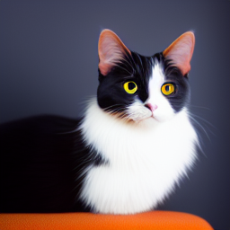
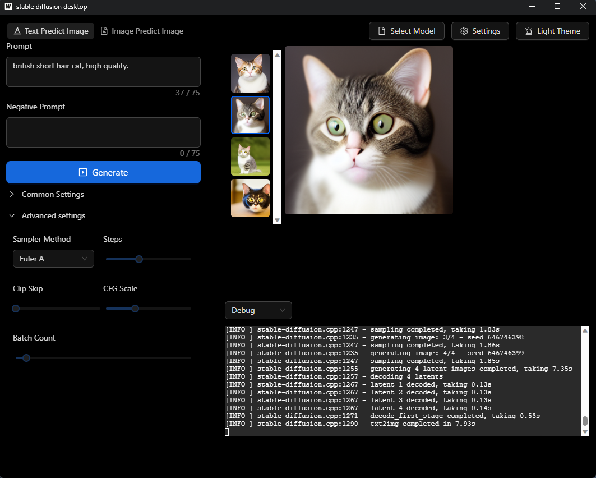

# Stable diffusion desktop

  

Minimalist stable-diffusion desktop application with only one executable file (No python required).

**It is currently in preview, so there may be many issues. Feedback is welcome.**

## Origin of the project

If you are interested, you can take a look at the [origin of the project](./docs/origin.md).

## User Guide
Download the latest release from [here](https://github.com/Cyberhan123/stable-diffusion-desktop/releases/latest)

## Features
- use [stable-diffusion.cpp](https://github.com/leejet/stable-diffusion.cpp) as backend
- SD1.x, SD2.x, SD-Turbo, SDXL-Turbo support
- 16-bit, 32-bit float and 4-bit, 5-bit, 8-bit integer quantization support
- Accelerated memory-efficient CPU inference
- Auto-detect CPU and GPU and cross-platform support
- Full Nvidia ( CUDA12 ) GPU backend and AMD GPU for GPU acceleration, Windows only.
  - Note: AMD GPU support is experimental and may not work properly and must set correct `weight type` By your self, don't use `Auto` option!!.
- Can load ckpt, safetensors, gguf and diffusers models/checkpoints. 
- Auto detect dark mode/ light mode
- Text Predict and Image Predict (up scaling come soon)
- TAESD support
- Sampling method
    - `Euler A`
    - `Euler`
    - `Heun`
    - `DPM2`
    - `DPM++ 2M`
    - [`DPM++ 2M v2`](https://github.com/AUTOMATIC1111/stable-diffusion-webui/discussions/8457)
    - `DPM++ 2S a`
    - [`LCM`](https://github.com/AUTOMATIC1111/stable-diffusion-webui/issues/13952)

## TODO
- [ ] UI improvements
- [ ] More acceleration platform support
- [ ] Upscaling support
- [ ] Remote server support
- [ ] terminal show full progress bar
- [ ] auto download model/checkpoint/lora
- [ ] auto update
- [ ] plugin support
- [ ] i18n support

## UI Preview

  

## Development

If you want to participate in the development, please check out the [development.md](./docs/development.md).

## Disclaimer

This program only provides capabilities related to Stable Diffusion inference. 
Users are required to comply with the relevant laws of the region and country where they are located, 
as well as the model license.
Any developer related to this software does not assume corresponding legal and supervisory obligations.
If you download and use this software, you have confirmed this disclaimer and the open source Licensed of this software.

## License

Copyright (c) Cyberhan123. All rights reserved. Licensed under the GPL-3.0 license. 
See License.txt in the project root for license information.
